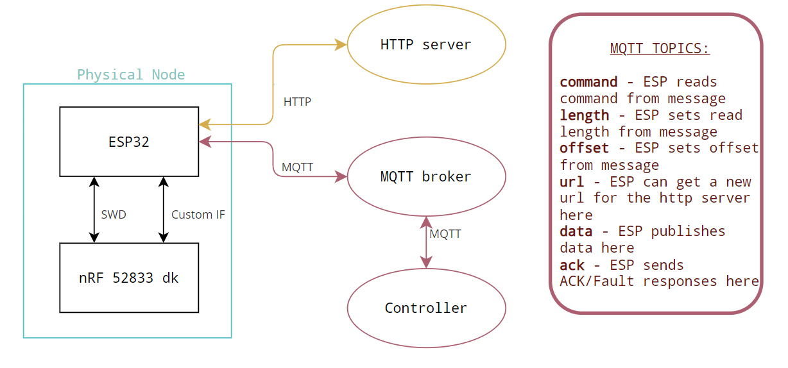
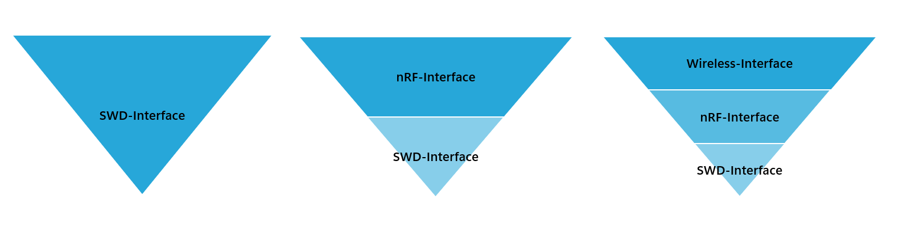
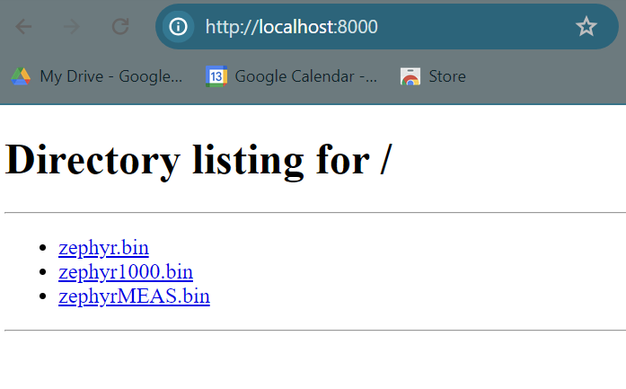

# ESP32 IoT debugger for nRF52833

This project allows you to 
- Write a .bin file to the internal flash memory of the nRF using SWD
- Download this .bin file from an external http-server
- Read the internal memory of the nRF into a .bin file (upload to server is not completed)
- Erase the internal flash memory of the nRF
- Complete a "non-interfering" measurement sequence, and then directly read the data from it's memory addresses using SWD

## Table of contents
1. [Project Guide](#project)
    1. [Dependencies](#DEPEND)
    2. [Structure](#STRUCT)
    3. [Howto](#HOWTO)

2. [About this project](#about)
    1. [Coding Philosophy](#philosophy)
    2. [How to make changes](#chage)
    3. [Comment your code](#comment)
    4. [Credits](#CREDIT)


## Project Guide

### Dependencies <a name="DEPEND"></a>
**Hardware used**
- nRF 52833 dk, build code Bxx or later
- ESP32 WROOM32 dk
- Regulated 3.3V or 5V power supply
- Connector between debugger input(P18) on nRF ESP32 pins e.g:
    - SOP24PIN + TCSD-05-D-12.00-01-N
    - DR127D254P10F
- (Optional) Logic Analyzer with SWD, Analog Discovery 2 can both handle this and act as power supply

**Software used**
- Arduino IDE 2.3.0
    - Board Manager: esp32 2.0.14 
- nRF Connect for VS Code 
    - Toolchain v2.5.0      
    - SDK v2.5.0
- Mosquitto 2.0.18

**External libraries**

ESP32
- LittleFS: from ESP32 Dev Module. Handles creating and storing files on the ESP32
- WiFi: from ESP32 Dev Module. Handles connection to WiFi 
- HTTPClient: from ESP32 Dev Module. Handles downloading of file from server
- PubSubClient: from ESP32 Dev Module. Handles MQTT communication 

nRF52833
- kernel.h       : zephyr specific
- drivers/gpio.h : zephyr specific
- devicetree.h   : zephyr specific
- sys/printk.h   : Used for logging debugging messages
- hal/nrf_gpio.h : Used for interacting with GPIO in "simple" way for the non-interfering measurement

### Structure <a name="STRUCT"></a>
**Full system overview**

The full system can be described by the following image:




**ESP32 libraries**

In this project there are three libraries included, which all build upon each other. The way this is done is through making each library class based, and then including an instance of the class "underneath" in the higher level :D

1. swd_interface : Handles basic SWD communication.  
2. nrf_interface : Handles larger sequences of SWD communication and port control unique to the Nordic Semiconductor CTRL-AP
3. wireless_interface : Handles downloading firmware, state-control through MQTT and editing global variables



Whenever you make a project you only need to use the topmost layer fitting your needs, since the layer underneath is included (with debugging messages off!) by default. If you just want to try this out on a single ESP the wireless layer might be redundant. Maybe you think the MQTT protocol is tiresome and want to switch to ESP-NOW instead? Then editing or replacing the wireless_interface is your best bet. Or maybe you want to make SWD-communication for another device than the nRF52833? Then you might need to edit or replace the nRF-interface. Or maybe you have an ESP with more storage and want to upload/process full .hex files instead of the unruly .bin files? Head on over to the nrf_interface and have fun! Lastly, maybe you want to observe the SWD communication protocol closer? Then you only need the SWD-interface.

**nRF 52833 testcode**

In this project you will also find three nRF 52833dk testcodes with their accompanying .bin file. The three projects are: two versions of the blinky sample with different blinking frequencies to visibly see the difference, and a non-interfering measurement code that produces different predictable data each iteration. 

*The non-interfering measurement*

The non-interfering measurement is a custom sequence that allows the ESP32 to request a measurement from the nRF. The nRF then completes this measurement, stores the data in at a pre-defined SRAM register, and then signals to the ESP32 that the data can be read over SWD. The intended use for this is with the Nordic Distance Measurement library, which needs to run un-interrupted and preferrably needs a "start signal"

[A great example of how to use the dm-library in a similar way can be found here](https://github.com/wulffern/nrfdmiq)

### Howto<a name="HOWTO"></a>
Okay, so you downloaded project_main and now you want to know how to set this up in the simplest possible way? Cool, me too. You will need a computer, a phone, an ESP32 and a nRF 52833dk to follow along this guide, but exchanges can be made!

**WiFi**

Setting everything up "the simple way" requires everything(your computer and your ESP32) to be on the same Wireless Network. For testing purposes I recommend setting up a 2.4GHz hotspot on your phone for this. 

**ESP32**
1. Open the nRF_SWD.ino file with Arduino IDE
2. Select the ESP32 Dev Module in your Board Manager, then head to Tools > Partition Scheme and select "No OTA(2MB APP/ 2MB SPIFFS)", "No OTA(1MB APP/ 3MB SPIFFS)", or even more SPIFFS if you have an ESP32 with more memory
3. Change WiFi info and IP-addresses(IP for http-server and mqtt-broker will be explained under)
3. Click Verify -> then Upload any bugs here might be related to your Board version, external libraries or similar
4. Your ESP32 is good to go! 
> Hint! The onboard LED will light up if the module cannot connect WiFi or the MQTT broker 

**HTTP server**

If you have python installed on your computer setting up a simple HTTP server is luckily fairly simple. Underneath is a condensed version of [this tutorial](https://developer.mozilla.org/en-US/docs/Learn/Common_questions/Tools_and_setup/set_up_a_local_testing_server)
1. Make sure your computer is connected to the same Wireless Network as your ESP32 will be
2. Use cd to get to the folder where your .bin files are stored
```shell
$ cd ../Desktop/testfolder
```
3. Enter the following 
```shell
# If Python version returned above is 3.X
# On Windows, try "python -m http.server" or "py -3 -m http.server"
python3 -m http.server
# If Python version returned above is 2.X
python -m SimpleHTTPServer
```
4. Use a browser to check wheter or not your server is on by entering this to the search line
```shell
localhost:8000
``` 
It should look something like this:

5. Get the IP-address. On a Windows machine you can run Get-NetIPAddress in another Powershell tab. Look for **InterfaceAlias: WiFi**. You can test the IP address by again heading to your browser and enter this to the searchline
```shell
#Replace with your IP
192.100.60.100:8000
```

**MQTT broker**

For this project I decided to use the Mosquitto broker for handling MQTT messages. After you've downloaded the mosquitto broker we need to change some settings to make it less secure (for the sake of the simple way, but I do recommend adding security in a more permanent build). The installation path is by default **C:\Program Files\mosquitto**. Use cd in Powershell to get into this directory. Edit the file called mosquitto.conf and add the following lines:
```shell
listener 1883
allow_anonymous true
```
With powershell still inside the mosquitto folder you can now run
```shell
C:\Program Files\mosquitto > mosquitto.exe -v -c mosquitto.conf
```
Cool, you can now use other powershell tabs and subscribe or publish to different topics.
The IP address for the broker should now be the same as the one found in the http section. 

**Ready to go**

Wonderful, lets use MQTT to control our device

1. Let's use mosquitto to subscribe to the topic: ack
```shell
C:\Program Files\mosquitto > mosquitto_sub.exe -t "ack"
```
2. Let's download code from our HTTP server and use the debugger to program the nRF, you could have set a predefined url for this in the esp23 setup, but heres how to change it as well
```shell
#Set your url
C:\Program Files\mosquitto > mosquitto_pub.exe -t url -m http://XXX.XXX.XXX.XXX:8000/filename.bin
#Download firmware, check ACK
C:\Program Files\mosquitto > mosquitto_pub.exe -t command -m DF
#Flash firmware to nRF, check ACK
C:\Program Files\mosquitto > mosquitto_pub.exe -t command -m FW
```
> Hint! most .bin files must be uploaded with offset=0 so don't change it unless you know whats up

## About the project <a name="about"></a>
### Coding Philosophy <a name="philosophy"></a>
- All changes will be peer-reviewed before entering main, a pull-request must be approved or commented on by another user before merging
- All changes must be well documented and commented before a peer-review
- Activly use the tools: Issues, Branches and Forks
- Readability counts: this repository uses CAPSLOCK for constants and peripheralname_name for all other applicable cases
- Small is beautiful: Prefer to make separate .c and .h files for each peripheral or major function
- nRF builds can become very large. With the exception of main/full_builds only upload the relevant files (usually .c, .h, prj.config)

### How to make changes <a name="change"></a>
There are three main ways to make changes to this repository
1. **Use Issues:** This is used for making suggestions, tasks or marking bugs. See more info under [Creating issues](https://docs.github.com/en/issues/tracking-your-work-with-issues/creating-an-issue). We recommend the method "Creating an issue from a repository". Use this when you have an idea/error but don't yet know how to fix it or wheter you want to fix it. You can think of an issue as a "mini-forum"
2. **Use Branches and Pull requests:** This is for when you think you have a solution to a problem done already. A branch is in essence a temporary workplace that you later can merge with the main repository. Once you have made changes to a branch you make a Pull request. The pull request lets others know which changes you have made to the branch, so that you can discuss and review before merging the content into main. (Try to avoid making branches of branches)
3. **Use Forks:** This is mostly used for major changes "when the intent is to create a independent project, which may never reunite". We strongly recommend that this is used when you want to change something fundamental in the project

### Comment your code <a name="comment"></a>
This project has three main types of comments: section comments, function comments and clarifying comments. All shown under:
```cpp
/***************************************************
            Section: Function definitions
****************************************************/


/* Function compares size of integers
 * @param[in] int1 The first integer
 * @param[in] int2 The second integer
 * @return true if int1 is larger than int2
 */
int compare_integers(int int1, int int2){
    if(int1 > int2){ //Compares the two values
       return true;
   }
   else{
       return false;
   }
}

```

### Credits <a name="CREDIT"></a>

